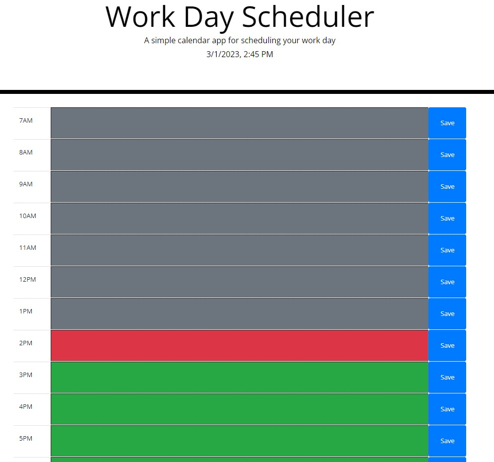

# Work Day Scheduler

## Description
If you ever want to plan out your workday in a simple tab on your browser, Work Day Scheduler is the best for you. There are places to input things to do for each hour then save the data. The hours even change color depending on if the hour is in the past present or future.

## Link to Application
https://jeffrylangford.github.io/scheduling-my-workday/

## User Story
```
AS A person who struggles with planning out their workday
I WANT a simple and easy-to-look at schedule
SO THAT I better plan my day
```

## Screenshot


## Usage Information
Write any desired information in the boxes for each hour then click save when done. You can edit whenever you'd like by just overwriting or adding then clicking save again. After the day ends or whenever you need to clear the previous day's data, you can hit the "Clear Schedule" button.

---

## Questions

[Github](https://github.com/JeffryLangford)

[Email](jblangford97@gmail.com)
